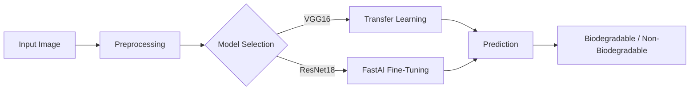

# ♻️ Waste Classification System


> **Automated Waste Segregation using Deep Learning**
>
> *Classifying waste into **Biodegradable** and **Non-Biodegradable** categories to promote sustainable waste management.*

---

## 📖 Introduction

Waste management is a global challenge. Efficient segregation is the first step towards effective recycling and pollution reduction. Manual sorting is slow and error-prone. 

This project implements an **automated waste classification system** using state-of-the-art computer vision models. By analyzing images of waste, the system accurately categorizes them, facilitating smarter waste management solutions for smart cities and recycling facilities.

---

## ✨ Key Features

- **High Accuracy**: Achieves **98.86% accuracy** using a fine-tuned ResNet18 model.
- **User-Friendly Interface**: a Clean, modern web app built with **Streamlit** for real-time classification.
- **Robustness**: Trained on a diverse dataset handling various lighting conditions, backgrounds, and object orientations.
- **Fast Inference**: Optimized for quick decision-making.

---

## 📊 Dataset

- **Source**: [Kaggle Non and Biodegradable Waste Dataset](https://www.kaggle.com/datasets/rayhanzamzamy/non-and-biodegradable-waste-dataset)
- **Total Images**: ~256,000 (including augmentations)
- **Classes**:
    - 🌱 **Biodegradable**: Food waste, plants, organic matter.
    - ♻️ **Non-Biodegradable**: Plastics, metals, glass, inorganic materials.
- **Preprocessing**: 
    - Resized to **192x192** pixels.
    - Normalized to `[0, 1]` range.

---

## 🧠 Model Architecture & Performance

We experimented with two primary architectures to find the best solution.

### Workflow



### Comparative Results

| Feature | VGG16 (Baseline) | **FastAI ResNet18 (Final)** |
| :--- | :--- | :--- |
| **Accuracy** | 88.43% | **98.86%** |
| **Input Size** | 60x60 | **192x192** |
| **Training Strategy** | Simple Transfer Learning | **Progressive Resizing & Fine-tuning** |
| **Framework** | TensorFlow/Keras | **FastAI / PyTorch** |

> The **FastAI ResNet18** model demonstrated superior performance, benefiting from higher resolution inputs and progressive training on augmented data.

---

## 🚀 Installation & Usage

### 1. Clone the Repository
```bash
git clone <repository-url>
cd Waste-Classification
```

### 2. Set up Environment
Ensure you have Python 3.10+ installed.
```bash
# It is recommended to use a virtual environment
python -m venv venv
source venv/bin/activate  # On Windows: venv\Scripts\activate
```

### 3. Install Dependencies
```bash
pip install -r requirements.txt
```

### 4. Run the Application
```bash
streamlit run app.py
```
The app will open in your default browser at `http://localhost:8501`.

---

## 📚 References

1. **F. Zhang et al.**, "Waste Classification using Deep Learning," *IEEE Trans. on Sustainable Computing*, 2020.
2. **A. Kumar & R. Singh**, "Automatic Waste Segregation using Image Processing," *IEEE ICIP*, 2019.
3. **J. Park et al.**, "Deep Learning Approach for Intelligent Waste Classification," *IEEE Access*, 2021.
4. Kaggle Dataset: [Non and Biodegradable Waste Dataset](https://www.kaggle.com/datasets/rayhanzamzamy/non-and-biodegradable-waste-dataset)

---

<p align="center">
  <i>Made for a cleaner, greener future. 🌍</i>
</p>
