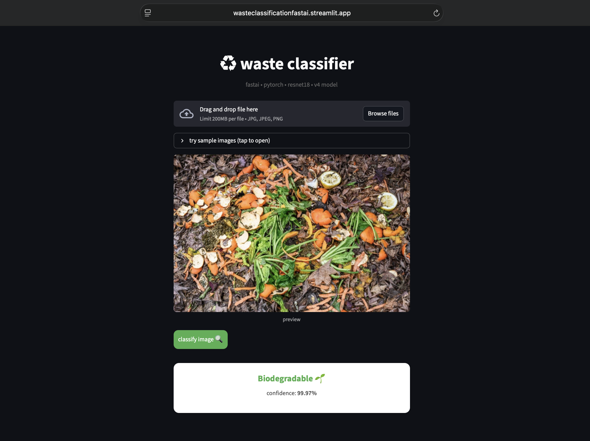
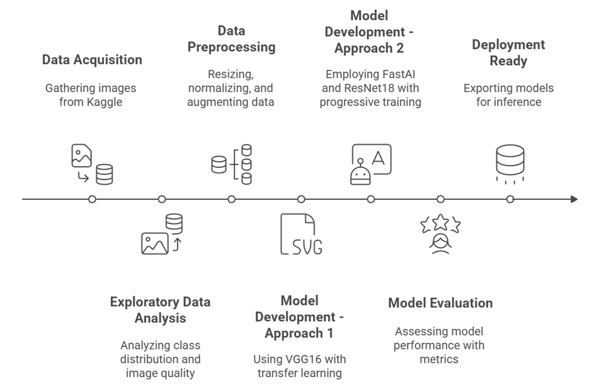

# ♻️ Waste Classification System


**Live Demo:** [wasteclassificationfastai.streamlit.app](https://wasteclassificationfastai.streamlit.app)

Classifying waste into **Biodegradable** and **Non-Biodegradable** categories to assist with waste management.



---

## Introduction

Efficient segregation is a key step in recycling and reducing pollution. This project uses a convolutional neural network to classify waste images automatically. The system is deployed as a web application for easy interaction.

---

## Features

- **High Accuracy**: 98.86% test accuracy using a fine-tuned ResNet18 model.
- **Web Interface**: A Streamlit application for real-time classification.
- **Robust Model**: Progressive resizing and augmentation were used to handle varied lighting and backgrounds.
- **Fast Inference**: Optimized for quick predictions.

---

## Dataset

- **Source**: [Kaggle Non and Biodegradable Waste Dataset](https://www.kaggle.com/datasets/rayhanzamzamy/non-and-biodegradable-waste-dataset)
- **Total Images**: ~256,000 (including augmentations)
- **Categories**:
    - **Biodegradable**: Food waste, plants, organic matter.
    - **Non-Biodegradable**: Plastics, metals, glass, inorganic materials.
- **Preprocessing**: 
    - Resized to **192x192** pixels.
    - Normalized to `[0, 1]`.

---

## Model Architecture

We compared a custom VGG16 implementation with a Transfer Learning approach using ResNet18 (FastAI). The ResNet18 model (v4) provided the best results.

### Workflow



### Performance Comparison

| Feature | VGG16 (Baseline) | **FastAI ResNet18 (Final)** |
| :--- | :--- | :--- |
| **Accuracy** | 88.43% | **98.86%** |
| **Input Size** | 60x60 | **192x192** |
| **Training** | Standard Transfer Learning | **Progressive Resizing** |
| **Framework** | TensorFlow/Keras | **FastAI / PyTorch** |

The **FastAI ResNet18** model showed significant improvement due to the higher resolution inputs and the progressive training strategy.

---

## Installation

### 1. Clone the Repository
```bash
git clone <repository-url>
cd Waste-Classification
```

### 2. Set up Environment
```bash
python -m venv venv
source venv/bin/activate  # Windows: venv\Scripts\activate
```

### 3. Install Dependencies
```bash
pip install -r requirements.txt
```

### 4. Run Locally
```bash
streamlit run app.py
```

---

## References

1. **F. Zhang et al.**, "Waste Classification using Deep Learning," *IEEE Trans. on Sustainable Computing*, 2020.
2. **A. Kumar & R. Singh**, "Automatic Waste Segregation using Image Processing," *IEEE ICIP*, 2019.
3. **J. Park et al.**, "Deep Learning Approach for Intelligent Waste Classification," *IEEE Access*, 2021.
4. Dataset: [Kaggle](https://www.kaggle.com/datasets/rayhanzamzamy/non-and-biodegradable-waste-dataset)
